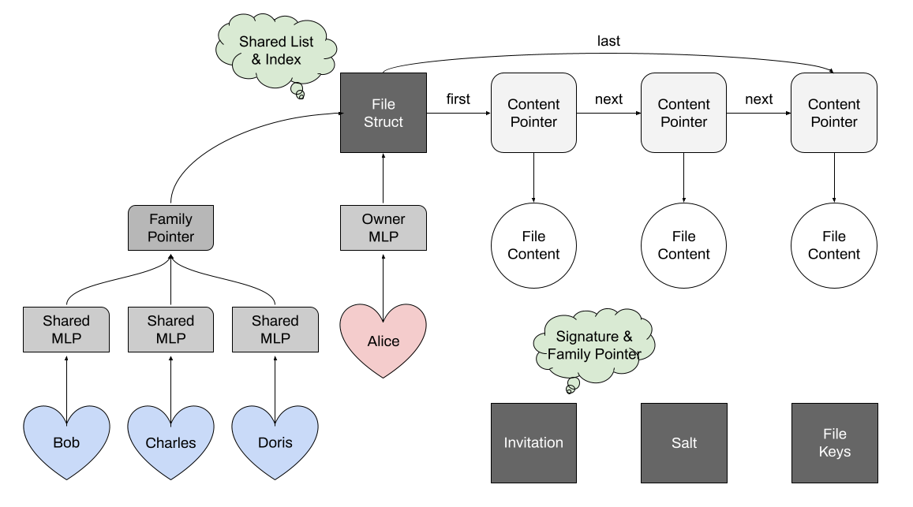

# End-to-End Encrypted File Sharing System

## Spec: 
> The full spec can be read here: https://su22.cs161.org/proj2/
> 
A client application for a secure file sharing system secured with cryptography.

Since it is secured with cryptography, the server cannot view or tamper the data saved.

## Description:
The users can take the following actions:
1. authenticate with a username and password
2. save files to the server
3. store files on the server
4. overwrite saved files on the server
5. append to saved files on the server
6. load saved files from the server
7. share saved files with other users
8. revoke access to previously shared files

## Notes: 
There are two main servers:
- KeyStore: a trusted server where users can publish their public keys
- DataStore: an untrusted server that provides persistent storage

Cryptography is used for security:
- AES-CTR mode encryption (symmetric)
- HMAC tags (symmetric)
- RSA-OEAP encryption (asymmetric)
- digital signatures (asymmetric)
- a 64-byte SHA-512 hash function
- a random byte generator

Additionally used imports:
- Golang JSON library for serializing and deserializing data
- Google UUID library for storing the data in the server

The overall design of the system can be found here: 
- data structures, algorithms, and testing
